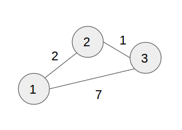

# Distance vector routing
> Implement distance vector routing protocol for a simple topology of routers.

### Compile
```bash
$ gcc distance.c -o distance
```

### Example Graph


### Run
```bash
$ ./distance
No.of routers: 3
Enter cost matrix:
0 2 7
2 0 1
7 1 0
Distance vector

Router: 1
Node 1 via 1, Distance 0
Node 2 via 2, Distance 2
Node 3 via 2, Distance 3

Router: 2
Node 1 via 1, Distance 2
Node 2 via 2, Distance 0
Node 3 via 3, Distance 1

Router: 3
Node 1 via 2, Distance 3
Node 2 via 2, Distance 1
Node 3 via 3, Distance 0
```

Source: [TheLearningPoint](http://www.thelearningpoint.net/computer-science/c-program-distance-vector-routing-algorithm-using-bellman-ford-s-algorithm)
